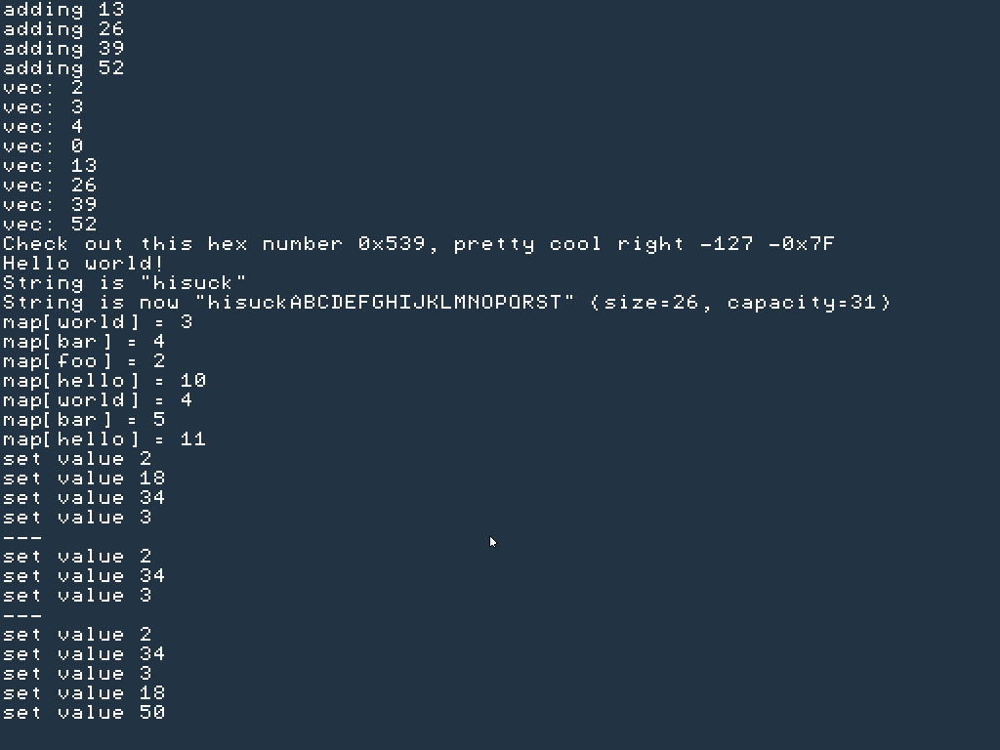

# MAT os

a hobby os dev project

only targets x86

# Features
- nothing much really
- my own stl
- malloc that doesnt even using paging because i still dont understand paging
- bad code
- terrible graphical system that i will remove
- c++20
